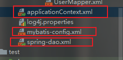
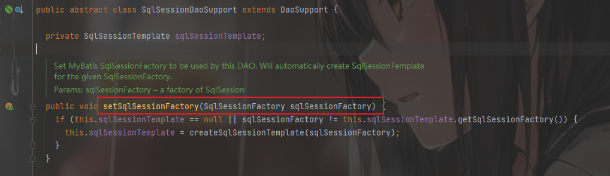
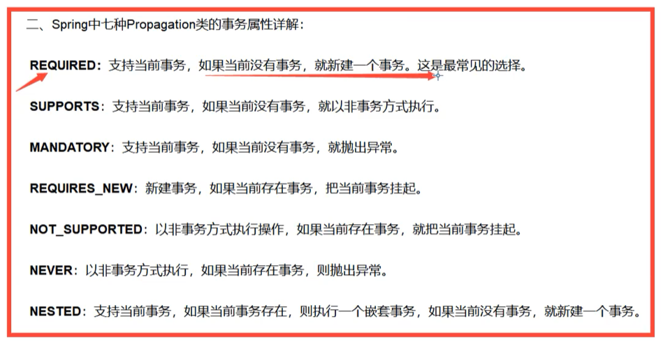

##配置文件
```xml
<?xml version="1.0" encoding="UTF-8"?>
<!--suppress ALL -->
<beans xmlns="http://www.springframework.org/schema/beans"
       xmlns:xsi="http://www.w3.org/2001/XMLSchema-instance"
       xmlns:context="http://www.springframework.org/schema/context"
       xsi:schemaLocation="http://www.springframework.org/schema/beans
        http://www.springframework.org/schema/beans/spring-beans.xsd
        http://www.springframework.org/schema/context
        http://www.springframework.org/schema/context/spring-context.xsd">
    <context:annotation-config/>
    <!--autowired注解的识别机制：先byType，如果只找到一个bean则直接注入，如果找到多个bean，则按照byName来寻找和
    set方法的名字对应的bean，若找不到则报错
        Resource注解也是一样，但是这种注解可以直接在注解的后面定义识别的bean的名字-->
    <bean id="address" class="com.slayerd05.pojo.Cat"/>
    <bean id="student" class="com.slayerd05.pojo.Dog"/>

    <bean id="people" class="com.slayerd05.pojo.People">
        <property name="name" value="宋雨东"/>
    </bean>
</beans>
```

##IOC和AOP
```
IOC是控制反转，是本来A调用B，需要在A类中new B（），现在交给spring框架和容器管理了。
IoC 的思想就是两方之间不互相依赖，由第三方容器来管理相关资源。这样有什么好处呢？
对象之间的耦合度或者说依赖程度降低；
资源变的容易管理；比如你用 Spring 容器提供的话很容易就可以实现一个单例。
IoC（Inverse of Control:控制反转）是一种设计思想 或者说是某种模式。这个设计思想就是 
将原本在程序中手动创建对象的控制权，交由 Spring 框架来管理。 
IoC 在其他语言中也有应用，并非 Spring 特有。IoC 容器是 Spring 用来实现 IoC 的载体，
IoC 容器实际上就是个 Map（key，value）,Map 中存放的是各种对象。
IoC 最常见以及最合理的实现方式叫做依赖注入（Dependency Injection，简称 DI）。

PS:之前程序内对象的创建由程序主动控制，控制反转后程序内对象的创建的主动权则移交到了客户端手中，
因此不必大量修改业务层代码，只需要传入不同的对象即可


AOP：Aspect oriented programming 面向切面编程，AOP 是 OOP（面向对象编程）的一种延续。
OOP 编程思想可以解决大部分的代码重复问题。但是有一些问题是处理不了的。
比如在父类 Animal 中的多个方法的相同位置出现了重复的代码，OOP 就解决不了。
这部分重复的代码，一般统称为 横切逻辑代码。
横切逻辑代码存在的问题：
	1.代码重复问题
	2.横切逻辑代码和业务代码混杂在一起，代码臃肿，不变维护
AOP 另辟蹊径，提出横向抽取机制，将横切逻辑代码和业务逻辑代码分离
AOP 主要用来解决：在不改变原有业务逻辑的情况下，增强横切逻辑代码，根本上解耦合，避免横切逻辑代码重复。
切 ：指的是横切逻辑，原有业务逻辑代码不动，只能操作横切逻辑代码，所以面向横切逻辑
面 ：横切逻辑代码往往要影响的是很多个方法，每个方法如同一个点，多个点构成一个面。这里有一个面的概念
```
```java
//控制反转前代码：
public class MyTest {
    @Test
    public void test(){
        UserServiceImpl userService = new UserServiceImpl();
        userService.getUser();
    }
}

public class UserServiceImpl implements UserService{
    private UserDao userDao = new UserDaoImpl();
    @Override
    public void getUser() {
        userDao.getUser();
    }
}


//控制反转后代码：
public class MyTest {
    @Test
    public void test(){
        UserServiceImpl userService = new UserServiceImpl();
        userService.setUserDao(new UserDaoMySqlImpl());
        userService.getUser();
    }
}

public class UserServiceImpl implements UserService {
    private UserDao userDao;

    public void setUserDao(UserDao userDao) {
        this.userDao = userDao;
    }

    @Override
    public void getUser() {
        userDao.getUser();
    }
}
```
##常用的依赖
```
        <!-- https://mvnrepository.com/artifact/org.springframework/spring-webmvc -->
        <dependency>
            <groupId>org.springframework</groupId>
            <artifactId>spring-webmvc</artifactId>
            <version>5.2.0.RELEASE</version>
        </dependency>
        <!-- https://mvnrepository.com/artifact/org.mybatis/mybatis -->
        <dependency>
            <groupId>org.mybatis</groupId>
            <artifactId>mybatis</artifactId>
            <version>3.4.6</version>
        </dependency>
        <!--log4j依赖-->
        <!-- https://mvnrepository.com/artifact/log4j/log4j -->
        <dependency>
            <groupId>log4j</groupId>
            <artifactId>log4j</artifactId>
            <version>1.2.17</version>
        </dependency>

        <!--junit依赖-->
        <!-- https://mvnrepository.com/artifact/junit/junit -->
        <dependency>
            <groupId>junit</groupId>
            <artifactId>junit</artifactId>
            <version>4.12</version>
            <scope>test</scope>
        </dependency>
        <!--MySQL依赖-->
        <dependency>
            <groupId>mysql</groupId>
            <artifactId>mysql-connector-java</artifactId>
            <version>5.1.47</version>
        </dependency>
        <!--Lombok-->
        <!-- https://mvnrepository.com/artifact/org.projectlombok/lombok -->
        <dependency>
            <groupId>org.projectlombok</groupId>
            <artifactId>lombok</artifactId>
            <version>1.18.20</version>
            <scope>provided</scope>
        </dependency>
        <!-- https://mvnrepository.com/artifact/org.mybatis.caches/mybatis-ehcache -->
        <dependency>
            <groupId>org.mybatis.caches</groupId>
            <artifactId>mybatis-ehcache</artifactId>
            <version>1.1.0</version>
        </dependency>
        <dependency>
            <groupId>org.slf4j</groupId>
            <artifactId>slf4j-simple</artifactId>
            <version>1.7.25</version>
            <scope>compile</scope>
        </dependency>
```

##注解说明
```xml
<?xml version="1.0" encoding="UTF-8"?>
<beans xmlns="http://www.springframework.org/schema/beans"
       xmlns:xsi="http://www.w3.org/2001/XMLSchema-instance"
       xmlns:context="http://www.springframework.org/schema/context"
       xsi:schemaLocation="http://www.springframework.org/schema/beans
        http://www.springframework.org/schema/beans/spring-beans.xsd
        http://www.springframework.org/schema/context
        http://www.springframework.org/schema/context/spring-context.xsd">
    <context:annotation-config/>
    <!--autowired注解的识别机制：先byType，如果只找到一个bean则直接注入，如果找到多个bean，则按照byName来寻找和
    set方法的名字对应的bean，若找不到则报错
        Resource注解也是一样，但是这种注解可以直接在注解的后面定义识别的bean的名字-->
    <bean id="address" class="com.slayerd05.pojo.Cat"/>
    <bean id="student" class="com.slayerd05.pojo.Dog"/>

    <bean id="people" class="com.slayerd05.pojo.People">
        <property name="name" value="宋雨东"/>
    </bean>
</beans>
```
@Autowired:先byType，如果只找到一个bean则直接注入，如果找到多个bean，则按照byName来寻找和
set方法的名字对应的bean，若找不到则报错

@Resource:和Autowired注解一样，但是多了一条：这种注解可以直接在注解的后面定义识别的bean的名字

##衍生注解
```xml
<!--指定注解扫描包-->
<context:component-scan base-package="com.kuang.pojo"/>
```
```java
@Component("user")
// 相当于配置文件中 <bean id="user" class="当前注解的类"/>
public class User {
    public String name = "宋雨东";
}
```
```java
// 相当于配置文件中 <bean id="user" class="当前注解的类"/>
public class User {
    @Value("宋雨东")
    // 相当于配置文件中 <property name="name" value="秦疆"/>
    public String name;
}
```
@Component三个衍生注解
为了更好的进行分层，Spring可以使用其它三个注解，功能一样，目前使用哪一个功能都一样
@Controller：web层 @Service：service层 @Repository：dao层


#通过注解开发（舍弃掉配置文件）

1.用了@Bean注解
Test类
```java
public class MyTest06 {
    @Test
    public void test(){
        ApplicationContext context = new AnnotationConfigApplicationContext(SlayerdConfig.class);
        User user = context.getBean("getUser", User.class);
//        User user = context.getBean("user", User.class);
        System.out.println(user.getName());
//        System.out.println(user == user2);
    }
}
```
```java
@Configuration
public class SlayerdConfig {
    @Bean
    public User getUser(){
        return new User();
    }
//    public User getUser2(){
//        return new User();
//    }

}
/*这种方式，若想要拿到Spring容器中的User对应的Bean，则需要用@Bean注解所作用的
方法的方法名字去获取bean
此方法相当于在配置文件中使用了：<bean id="getUser" class="com.slayerd06.pojo.User"/>
*/
```
2.用了@Component注解
Test类
```java
public class MyTest06 {
    @Test
    public void test(){
        ApplicationContext context = new AnnotationConfigApplicationContext(SlayerdConfig.class);
//        User user = context.getBean("getUser", User.class);
        User user = context.getBean("user", User.class);
        System.out.println(user.getName());
//        System.out.println(user == user2);
    }
}
```
```java
//配置类
@Configuration
@ComponentScan("com.slayerd06")
public class SlayerdConfig {
//    @Bean
//    public User getUser(){
//        return new User();
//    }
//    public User getUser2(){
//        return new User();
//    }
}

//实体类
@Data
@Component
public class User {
    private String name = "syd";

}
/*
 * 而如果只是使用了@Component注解的话，可以直接将@Bean注解省略不写,直接通过user
 * 来拿到Spring容器中的User对应的bean。因为@ComponentScan注解扫描到的@Component组件
 * 所作用的实体类，将会直接以默认的名字（实体类名所对应的小写名字）建立bean
 * 此方法相当于配置文件中的：
<?xml version="1.0" encoding="UTF-8"?>
<beans xmlns="http://www.springframework.org/schema/beans"
       xmlns:xsi="http://www.w3.org/2001/XMLSchema-instance"
       xmlns:context="http://www.springframework.org/schema/context"
       xsi:schemaLocation="http://www.springframework.org/schema/beans
        http://www.springframework.org/schema/beans/spring-beans.xsd
        http://www.springframework.org/schema/context
        http://www.springframework.org/schema/context/spring-context.xsd">
    <context:component-scan base-package="com.slayerd07"/>
    <context:annotation-config/>
</beans>
 *  */

```

#代理模式
##静态代理
***静态代理的proxy和委托类皆需要实现同一个接口，就像是中介和房东的关系***
```java
//需实现的接口
public interface Rent {
    public void rent();
}

//房东
public class LandLord implements Rent{
    @Override
    public void rent() {
        System.out.println("我要出租房子");
    }
}

//中介，代理
public class LandLordProxy implements Rent{
    private LandLord landLord;
    public LandLordProxy() {
    }
    public LandLordProxy(LandLord landLord) {
        this.landLord = landLord;
    }

    @Override
    public void rent() {
        System.out.println("==============代理开始=============");
        landLord.rent();
    }
}


//客户租房的过程
public class Client {
    public static void main(String[] args) {
        LandLordProxy landLordProxy = new LandLordProxy(new LandLord());
        landLordProxy.rent();
    }
}
```
***在静态代理中，客户不需要实例化房东这个委托类，只需要找到房东委托的代理类，然后告诉代理类
自己想要租的房子是哪个房东的即可，实现的过程是：
客户找到代理中介-->中介知道了客户的目标房东-->中介内部调用实现的接口方法，该方法内调用了房东类中实现的租房方法。***

###静态代理的优点：
可以在不更改委托类（实现类）的情况下，在代理类中对其进行功能新增
###静态代理的缺点：
当工作中有多个接口需要代理类的时候，会造成代码的冗长和繁琐，所以便有了后来的动态代理

---------------------------------------------------------------------------------------------
##动态代理
动态代理需要，反射下的InvocationHandler和Proxy
```java
//需实现的接口
public interface Rent {
    public void rent();
}

//房东
public class LandLord implements Rent{
    @Override
    public void rent() {
        System.out.println("我要出租房子");
    }
}

//编写代理处理器，可以当作一个工具类
public class ProxyHandler implements InvocationHandler {
    private Object target;

    public void setTarget(Object target) {
        this.target = target;
    }

    public Object getProxy(){
        return Proxy.newProxyInstance(this.getClass().getClassLoader(),target.getClass().getInterfaces(),this);
    }

    //只要是调用了委托类的任意一种方法，这里的invoke方法都会执行
    @Override
    public Object invoke(Object proxy, Method method, Object[] args) throws Throwable {
        System.out.println("==========代理==========");
        Object result = method.invoke(target, args);
        return result;
    }
}

//客户租房的过程
public class Client {
    public static void main(String[] args) {
        LandLord landLord = new LandLord();
        ProxyHandler proxyHandler = new ProxyHandler();
        proxyHandler.setTarget(landLord);
        Rent proxy = (Rent) proxyHandler.getProxy();
        proxy.rent();
    }
}
/*此时的强转，一定要转成父接口，不要转成委托类（接口的实现类）,因为Proxy.newProxyInstance(ClassLoader loader,Class<?>[] interfaces, InvocationHandler h)
方法的参数interface指的是该参数的父类接口，所以获得的返回值是参数的父类，否则会报错。
 */
```
###动态代理的优势：
***静态代理的优势他全都有，并且比静态代理更好的一点是动态代理解决了代码冗长的问题，如果有多个
接口需要代理的话，我们仅仅需要将代理处理器中的入参改变即可，不需要为每一个接口都编写代理类。***
###动态代理的缺点：
***和朋友讨论过之后，我们的理解便是，动态代理的缺点存在于JVM层面，由于静态代理对应的接口是确定的，所以当我们为一个接口编写了
静态代理类，我们便相当于多调用了一次这个接口的方法（相对于普通调用来说），由于JVM有计数器，于是这个方法将会上升到栈的顶部，而编译的时候
会有：”判断代码是否为热代码“这一步骤，如果方法被调用多次，那便被定义为热代码。但是动态代理由于是通过反射进行的代理，所以无法预知被调用的
接口和方法。于是这些代码不属于热代码的范畴，所以动态代理没有静态代理的速度快。***

#AOP
##Spring实现AOP的三种方式
###方式一：Spring API接口
继承API接口，重写方法
```java
@Component
public class AfterLog implements AfterReturningAdvice {
    @Override
    public void afterReturning(Object returnValue, Method method, Object[] args, Object target) throws Throwable {
        System.out.println(target.getClass().getName()+"的方法："+method.getName()+"执行完毕");
    }
}

@Component
public class BeforeLog implements MethodBeforeAdvice {

    @Override
    public void before(Method method, Object[] args, Object target) throws Throwable {
        System.out.println(method.getName()+"执行前输出日志：准备执行"+method.getName()+"方法");
    }
}

//测试类
public class MyTest09 {
    @Test
    public void test(){
        ApplicationContext context = new ClassPathXmlApplicationContext("ApplicationContext.xml");
        //动态代理代理的是接口，而不是接口的实现实现类
        TestService testService = context.getBean("testServiceImpl", TestService.class);
        testService.add();
    }
}
```
```xml
<?xml version="1.0" encoding="UTF-8"?>
<beans xmlns="http://www.springframework.org/schema/beans"
       xmlns:xsi="http://www.w3.org/2001/XMLSchema-instance"
       xmlns:context="http://www.springframework.org/schema/context"
       xmlns:aop="http://www.springframework.org/schema/aop"
       xsi:schemaLocation="http://www.springframework.org/schema/beans
        http://www.springframework.org/schema/beans/spring-beans.xsd
        http://www.springframework.org/schema/context
        http://www.springframework.org/schema/context/spring-context.xsd
        http://www.springframework.org/schema/aop
        http://www.springframework.org/schema/aop/spring-aop.xsd">

    <context:component-scan base-package="com.slayerd09"/>
<!--    <bean id="afterLog" class="com.slayerd09.log.AfterLog"/>-->
<!--    <bean id="beforeLog" class="com.slayerd09.log.BeforeLog"/>-->
<!--    <bean id="testServiceImpl" class="com.slayerd09.service.impl.TestServiceImpl"/>-->
    <!--方式一,无切面-->
    <aop:config>
        <aop:pointcut id="pointcut" expression="execution(* com.slayerd09.service.impl.TestServiceImpl.*(..))"/>
        <aop:advisor advice-ref="beforeLog" pointcut-ref="pointcut"/>
        <aop:advisor advice-ref="afterLog" pointcut-ref="pointcut"/>
    </aop:config>
</beans>
```
***需注意的点：***
1.引入aop对应标签。2.先定义创建的类的bean（这里我是采用的@ComponentScan方法自动装配的bean），然后定义pointcut标签，确定切入点，最后用advisor标签实现切入前后所调用的方法。
---

###方法二：自定义类实现AOP
不需要继承任何接口，但是需要在配置文件中设置切面
```java
public class PointCut {
    public void beforeMethod(){
        System.out.println("方法执行之前打印日志");
    }
    public void afterMethod(){
        System.out.println("方法执行之后打印日志");
    }
}

//测试类
public class MyTest09 {
    @Test
    public void test(){
        ApplicationContext context = new ClassPathXmlApplicationContext("ApplicationContext.xml");
        //动态代理代理的是接口，而不是接口的实现实现类
        TestService testService = context.getBean("testServiceImpl", TestService.class);
        testService.add();
    }
}
```
```xml
<?xml version="1.0" encoding="UTF-8"?>
<beans xmlns="http://www.springframework.org/schema/beans"
       xmlns:xsi="http://www.w3.org/2001/XMLSchema-instance"
       xmlns:context="http://www.springframework.org/schema/context"
       xmlns:aop="http://www.springframework.org/schema/aop"
       xsi:schemaLocation="http://www.springframework.org/schema/beans
        http://www.springframework.org/schema/beans/spring-beans.xsd
        http://www.springframework.org/schema/context
        http://www.springframework.org/schema/context/spring-context.xsd
        http://www.springframework.org/schema/aop
        http://www.springframework.org/schema/aop/spring-aop.xsd">

    <context:component-scan base-package="com.slayerd09"/>
    <!--方式二，建立一个切面-->
    <bean id="pointcut" class="com.slayerd09.diy.PointCut"/>
    <aop:config>
        <aop:aspect ref="pointcut">
            <aop:pointcut id="point" expression="execution(* com.slayerd09.service.impl.TestServiceImpl.*(..))"/>
            <aop:after method="afterMethod" pointcut-ref="point"/>
            <aop:before method="beforeMethod" pointcut-ref="point"/>
        </aop:aspect>
    </aop:config>
</beans>
```
***需要注意的点:***

1.自己建立的类需要在xml中使用aspect标签配置切面,引用指向该类的bean.2.配置好切面之后和方法一样要确定切入点.3.但是和方法一不一样的是该方法的实现切入标签指向的是类中的方法名,但是方法一的实现切入标签
指向的是类的bean的id.

**方式一和方式二的区别**

方式一更加强大,因为方式一继承的接口之后重写了方法,方法中有很多参数,可以获得委托类的class,method,方法执行后返回的值等.

###方式三:注解实现AOP
第一步,先创建一个切面,然后采用Aspect注解
```java
@Aspect
public class AnnotationPointCut {
    @Before("execution(* com.slayerd09.service.impl.TestServiceImpl.*(..))")
    public void beforeMethod(){
        System.out.println("方法执行前");
    }
    @After("execution(* com.slayerd09.service.impl.TestServiceImpl.*(..))")
    public void afterMethod(){
        System.out.println("方法执行后");
    }
}
```
该方法需要在配置文件中配置Aspect自动开启
```xml
<?xml version="1.0" encoding="UTF-8"?>
<beans xmlns="http://www.springframework.org/schema/beans"
       xmlns:xsi="http://www.w3.org/2001/XMLSchema-instance"
       xmlns:context="http://www.springframework.org/schema/context"
       xmlns:aop="http://www.springframework.org/schema/aop"
       xsi:schemaLocation="http://www.springframework.org/schema/beans
        http://www.springframework.org/schema/beans/spring-beans.xsd
        http://www.springframework.org/schema/context
        http://www.springframework.org/schema/context/spring-context.xsd
        http://www.springframework.org/schema/aop
        http://www.springframework.org/schema/aop/spring-aop.xsd">

    <context:component-scan base-package="com.slayerd09"/>
    <!--方式三,注解实现AOP-->
    <bean id="annotationPointCut" class="com.slayerd09.diy.AnnotationPointCut"/>
    <!--expose-proxy默认是false,如果是false,则用的jdk,true则用的cglib-->
    <aop:aspectj-autoproxy expose-proxy="false"/>
</beans>
```
***需要注意的点:***

1.使用注解实现AOP的时候,一定要在配置文件中配置自动代理<aop:aspectj-autoproxy expose-proxy="false"/>

这种方式的弊端在于,切面中的每一个方法上都需要加上注解,所以会导致后续代码维护问题.这三种方式,最合理的方式是方式一和方式二

<mark>***AOP总结下来就是一句话:在不更改原有业务代码的情况下,通过代理模式实现业务增强***</mark>


#<mark>整合Spring和Mybatis</mark>
##方式一:配置文件整合
第一步:在resources目录下建立Spring和Mybatis的配置文件,
1.配置数据源datasource,此步直接将Mybatis中的environments部分整合到Spring配置文件中---->
2.(思路)想要拿到sqlSession,那么必须有SqlSessionFactory,所以第二步是建立SqlSessionFactory,将上一步配置好的数据源丢到SqlSessionFactory的bean标签内.
用到的包是Spring下的SqlSessionFactoryBean---->3.已经有了SqlSessionFactory,那么这一步便是通过SqlSessionFactory建立SqlSession,此步骤用到的是Spring下的SqlSessionTemplate
SqlSessionTemplate可以完全替代我们在Mybatis中使用的SqlSession(SqlSessionTemplate是SqlSession的实现类)
    


***第一步做完之后,这个配置文件就放在这里不要改动了,这个配置文件的唯一目的就是拿到SqlSessionTemplate***

```xml
<?xml version="1.0" encoding="UTF-8"?>
<beans xmlns="http://www.springframework.org/schema/beans"
       xmlns:xsi="http://www.w3.org/2001/XMLSchema-instance"
       xmlns:context="http://www.springframework.org/schema/context"
       xmlns:aop="http://www.springframework.org/schema/aop"
       xsi:schemaLocation="http://www.springframework.org/schema/beans
        http://www.springframework.org/schema/beans/spring-beans.xsd
        http://www.springframework.org/schema/context
        http://www.springframework.org/schema/context/spring-context.xsd
        http://www.springframework.org/schema/aop
        http://www.springframework.org/schema/aop/spring-aop.xsd">
    <context:component-scan base-package="com.slayerd"/>
    <bean id="datasource" class="org.springframework.jdbc.datasource.DriverManagerDataSource">
        <property name="driverClassName" value="com.mysql.jdbc.Driver"/>
        <property name="username" value="root"/>
        <property name="password" value="123456"/>
        <property name="url" value="jdbc:mysql://localhost:3306/mybatis?useSSL=true&amp;useUnicode=true&amp;characterEncoding=UTF-8"/>
    </bean>
    <bean id="sqlSessionFactory" class="org.mybatis.spring.SqlSessionFactoryBean">
        <property name="dataSource" ref="datasource"/>
        <property name="configLocation" value="mybatis-config.xml"/>
    </bean>
    <bean id="sqlSessionTemplate" class="org.mybatis.spring.SqlSessionTemplate">
        <constructor-arg ref="sqlSessionFactory"/>
    </bean>
</beans>
```

第二步:在applicationContext.xml中配置每一个需要SqlSession的类的bean,然后import刚才配置好的获取SqlSession的配置文件(spring-dao.xml)
```xml
<?xml version="1.0" encoding="UTF-8"?>
<beans xmlns="http://www.springframework.org/schema/beans"
       xmlns:xsi="http://www.w3.org/2001/XMLSchema-instance"
       xmlns:context="http://www.springframework.org/schema/context"
       xmlns:aop="http://www.springframework.org/schema/aop"
       xsi:schemaLocation="http://www.springframework.org/schema/beans
        http://www.springframework.org/schema/beans/spring-beans.xsd
        http://www.springframework.org/schema/context
        http://www.springframework.org/schema/context/spring-context.xsd
        http://www.springframework.org/schema/aop
        http://www.springframework.org/schema/aop/spring-aop.xsd">
    <import resource="spring-dao.xml"/>
    <bean id="userServiceImpl" class="com.slayerd.service.impl.UserServiceImpl">
        <property name="sqlSession" ref="sqlSessionTemplate"/>
    </bean>
</beans>
```
***前两步完成之后,mybatis-config.xml配置文件中的内容已所剩无几,我决定在该配置文件中放置每一个类的别名,日志等settings配置和mapper注册配置***
```xml
<?xml version="1.0" encoding="UTF-8"?>
<!DOCTYPE configuration
        PUBLIC "-//mybatis.org//DTD Config 3.0//EN"
        "http://mybatis.org/dtd/mybatis-3-config.dtd">
<configuration>
<!--    <properties resource="db.properties"/>-->
    <settings>
        <setting name="logImpl" value="LOG4J"/>
        <setting name="mapUnderscoreToCamelCase" value="true" />
        <setting name="cacheEnabled" value="true"/>
    </settings>
    <typeAliases>
        <typeAlias type="com.slayerd.pojo.User" alias="user"/>
    </typeAliases>
    <mappers>
        <mapper resource="com/slayerd/dao/UserMapper.xml"/>
    </mappers>
</configuration>
```
第三步:建立User实体类和User对应的mapper,service和实现类,然后将
要实现类UserServiceImpl在配置文件中注入到Spring容器内,此时的测
试类中再无Mybatis的身影(例如通过Resources读取配置文件等步骤)
```xml
<bean id="userServiceImpl" class="com.slayerd.service.impl.UserServiceImpl">
    <property name="sqlSession" ref="sqlSessionTemplate"/>
</bean>
```
```java
@Data
public class User {
    private int id;
    private String userName;
    private String pwd;
}

public interface UserMapper {
    List<User> getUsers();
}

public interface UserService {
    public List<User> getUsers();
}

public class UserServiceImpl implements UserService {
    private SqlSessionTemplate sqlSession;

    public void setSqlSession(SqlSessionTemplate sqlSession) {
        this.sqlSession = sqlSession;
    }

    @Override
    public List<User> getUsers() {
        UserMapper mapper = sqlSession.getMapper(UserMapper.class);
        return mapper.getUsers();
    }
}

//测试类
public class MyTest {
    @Test
    public void test(){
        ApplicationContext context = new ClassPathXmlApplicationContext("applicationContext.xml");
        UserServiceImpl userServiceImpl = context.getBean("userServiceImpl", UserServiceImpl.class);
        List<User> users = userServiceImpl.getUsers();
        for (User user : users) {
            System.out.println(user);
        }
    }
}
```
##方式二:
方式一和方式二的方法相似，唯一的不同点就是，方式二的ServiceImpl不仅仅是Service的实现了，而且继承了SqlSessionDaoSupport类



阅读源码之后发现，只要给SqlSessionDaoSupport传入一个SqlSessionFactory，我们就可以调用getSqlSession方法获取SqlSession
于是我们便可以将Spring配置文件中的SqlSessionTemplate注入bean的步骤省去
```xml
<!--    <bean id="sqlSessionTemplate" class="org.mybatis.spring.SqlSessionTemplate">-->
<!--        <constructor-arg ref="sqlSessionFactory"/>-->
<!--    </bean>-->
```
直接在UserServiceImpl注入Spring容器时赋值
```xml
<?xml version="1.0" encoding="UTF-8"?>
<beans xmlns="http://www.springframework.org/schema/beans"
       xmlns:xsi="http://www.w3.org/2001/XMLSchema-instance"
       xmlns:context="http://www.springframework.org/schema/context"
       xmlns:aop="http://www.springframework.org/schema/aop"
       xsi:schemaLocation="http://www.springframework.org/schema/beans
        http://www.springframework.org/schema/beans/spring-beans.xsd
        http://www.springframework.org/schema/context
        http://www.springframework.org/schema/context/spring-context.xsd
        http://www.springframework.org/schema/aop
        http://www.springframework.org/schema/aop/spring-aop.xsd">
    <import resource="spring-dao.xml"/>
    <bean id="userServiceImpl" class="com.slayerd2.service.impl.UserServiceImpl">
        <property name="sqlSessionFactory" ref="sqlSessionFactory"/>
    </bean>
</beans>
```

#事务
##1.回顾事务
1.要么都成功,要么都失败
2.事务在开发中涉及到数据的一致性问题,确保完整性和一致性
3.把一组业务当成一个业务来做,所以可以保证要么成功,要么失败
4.事务的ACID:<mark>①原子性</mark>:确保要么都成功,要么都是失败.<mark>②一致性</mark>:一旦事务完成,要么都被提交,要么都失败.<mark>③隔离性</mark>:多个事务可能操作同一个资源,这些业务是互相隔离的,这个特性防止数据损坏.<mark>④持久性</mark>:事务一旦完成了,数据就被持久化存储了存储器中.

##2.配置文件实现声明式事务
当我们在Service实现类重写方法内调用了多个对数据库操作的方法,在不配置事务的前提下,我们会发现一个问题:如果我们的代码出现了错误,但是在出现错误之前已经有一个方法对数据库进行了操作(例如插入)
,我们会发现即使程序报错停止,我们的数据库仍然已经改变,多了一条对应的数据,这显然是不合理的,会对业务的数据造成损坏,不符合事务的特性.于是我们有了几种方法去配置事务

第一种便是在配置文件中配置:

1.我们既然要配置声明式事务,那我们第一步便需要对数据源进行事务管理.

```xml
    <!--声明式事务配置,对数据源进行事务管理-->
    <bean id="transaction-manager" class="org.springframework.jdbc.datasource.DataSourceTransactionManager">
        <property name="dataSource" ref="datasource"/>
    </bean>
```
2.接下来我们便需要对这个事务管理器进行配置(哪些方法开启事务).
```xml
    <!--事务管理器配置-->
<tx:advice id="txAdvice" transaction-manager="transaction-manager">
    <tx:attributes>
        <!-- 让所有的方法都加入事务管理，为了提高效率，可以把一些查询之类的方法设置为只读的事务 -->
        <tx:method name="*" propagation="REQUIRED" read-only="true" />
        <!-- 以下方法都是可能设计修改的方法，就无法设置为只读 -->
        <tx:method name="add*" propagation="REQUIRED" rollback-for="java.lang.Exception"/>
        <tx:method name="insert*" propagation="REQUIRED" />
        <tx:method name="del*" propagation="REQUIRED" />
        <tx:method name="update*" propagation="REQUIRED" />
        <tx:method name="save*" propagation="REQUIRED" />
        <tx:method name="clear*" propagation="REQUIRED" />
        <tx:method name="handle*" propagation="REQUIRED" rollback-for="java.lang.Exception"/>
    </tx:attributes>
</tx:advice>
```
此处的propagation有七大属性:


3.配置AOP切面,配置切点并且配置在哪一个方法开启事务
```xml
    <aop:config>
        <aop:pointcut id="pointCut" expression="execution(* com.slayerd3.service.impl.UserServiceImpl.getUsers()))"/>
        <aop:advisor advice-ref="txAdvice" pointcut-ref="pointCut"/>
    </aop:config>
```

在开启事务之后,在进行一次测试,便发现,如果程序中途报错,数据库也不会改变
```java
public class UserServiceImpl extends SqlSessionDaoSupport implements UserService {

    @Override
    public List<User> getUsers() {
        User user = new User();
        user.setUserName("宋雨东");
        user.setId(6);
        user.setPwd("123123");

        SqlSession sqlSession = getSqlSession();
        UserMapper mapper = sqlSession.getMapper(UserMapper.class);

        mapper.addUser(user);
        mapper.deleteUser(6);
        List<User> users = mapper.getUsers();
        return users;
    }
}
```